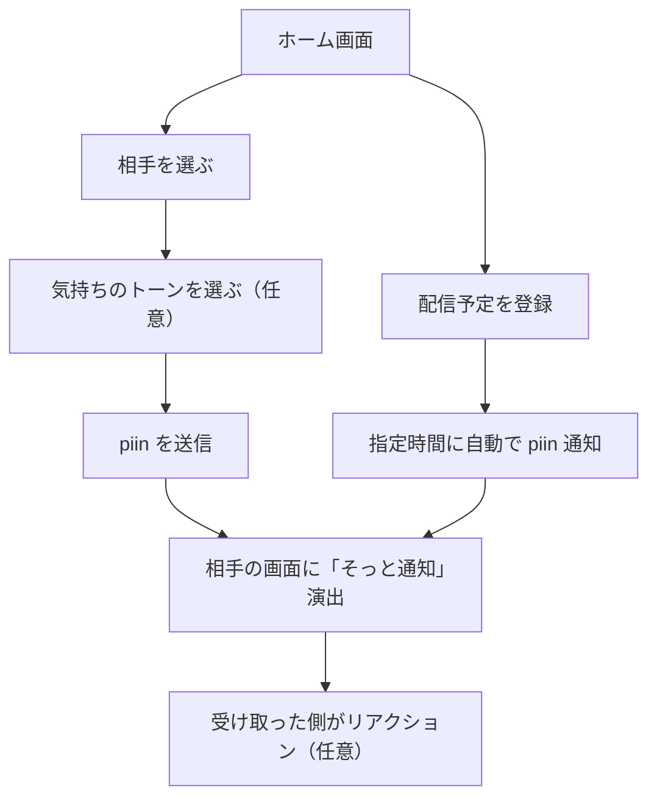

# piinxi UI/UX設計（立場を超える共通体験）

## 🌱 コアコンセプト

- 誰でも、「送る人」「受け取る人」になれる
- 会話しなくてもつながれる、“気配のコミュニケーション”
- 相手をラベリングしない。**家族も、友達も、推しも、同じ「あなた」**

---

## 🧭 アプリ構成（共通UI）

### 🏠 ホーム画面

- **「つながっている人」一覧**（アイコン＋名前）
- 各人に向けて、**そっと送るボタン**（大きめの“ふわっとした”送信ボタン）

#### ボタンのふるまい

- 軽くタップ → 即送信（デフォルトトーン）
- 長押し → 気持ちの“色”や“雰囲気”を選べる  
  例）🌿 静かに、🌤 やさしく、🔥 強く思ってる

#### 送信時の演出

- 自分側にはアニメーション（光る・キャラが動く）
- 相手側には静かな通知（音無し／画面がじわっと変化）

---

## 📥 受け取ったとき

- 通知エリアに表示されない「アプリ内通知」
- アプリを開くと**キャラがそっと現れる／色が変わる**などの視覚的演出
- そのpiinに「リアクション」する必要はないけど、**軽く返す選択もできる**
  - タップで「受け取ったよ」
  - 長押しで「ありがとう」をそっと返す

---

## 📡 「配信」も区別せずに組み込む

### 配信予定を「予定として登録」できる

- 予定時刻に自動で「そっとお知らせ」される（通知ON/OFF選べる）
- 予定に名前をつけず、「空気だけ」送ることも可  
  例：「あとで何かが始まる感じ」を共有するだけ

### 配信中・アクティブ状態の表現

- 「いま何かしてる」状態は、アイコンがふわっと光る
- それを見た人が「見てるよpiin」を送れる

### 配信後は、**誰でも「ありがとうpiin」が送れる**

- 特別な送り方ではなく、いつものpiinとして送る

---

## 🧸 UXのキーワード

| 要素 | 内容 |
|------|------|
| アカウント | 匿名可。名前もニックネームもなくても成立する設計 |
| フォロー概念 | “つながる”だけ。フォロー/フォロワーという構造なし |
| タイムライン | ない。通知もログも溜めない“今この瞬間”設計 |
| キャラ演出 | 通知は「キャラの表情」や「空気の変化」で表現 |
| 色と音 | 優しい色彩＋自然音のみ（風／水／光など） |

---

## ✨ ユースケース例（誰にでも当てはまる）

- おばあちゃんに「今日は元気だよ」を送る
- 大好きな配信者に「見てるよ」と送る
- 配信者が「あとで配信するね」と“空気”を送る
- 友達が「今日は静かにしてたい」空気だけを送る

---

## 💡 今後の拡張

- piinの色・揺れ方・音など、トーンのプリセット追加
- キャラや背景テーマのカスタマイズ（自分らしさを出せる）
- 物理ガジェット連携（通知ランプ／ぬいぐるみ／フォトスタンド）

## 機能フロー

